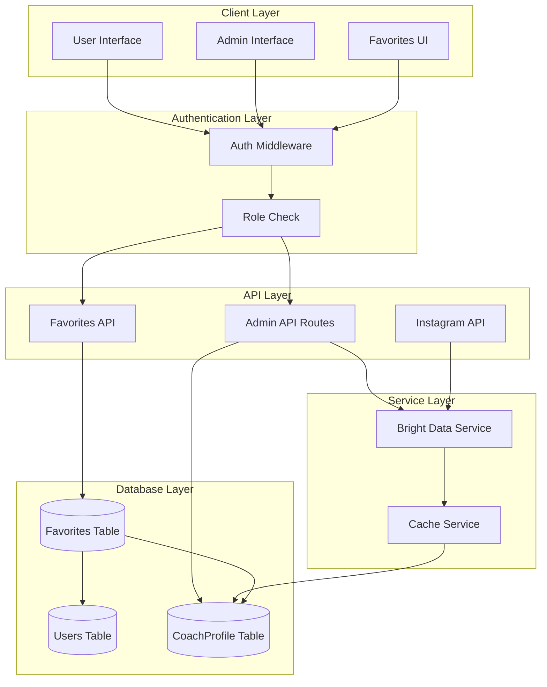
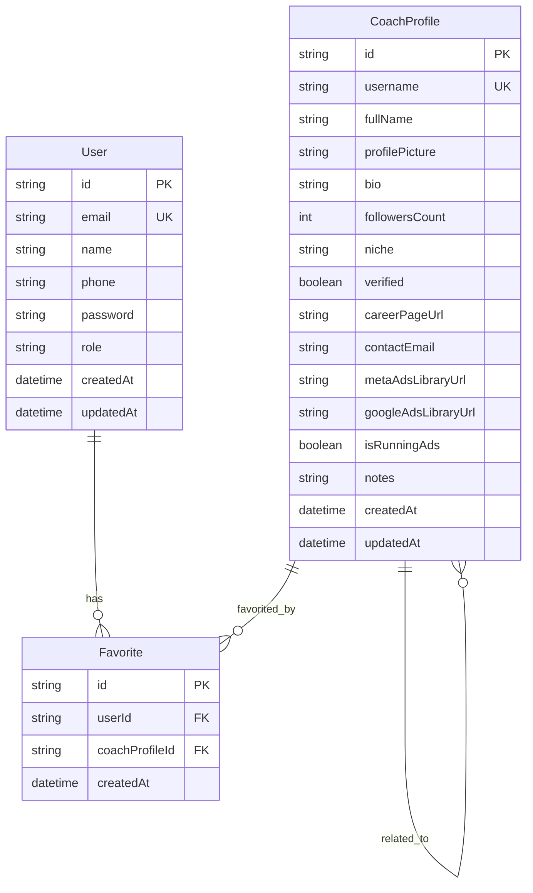
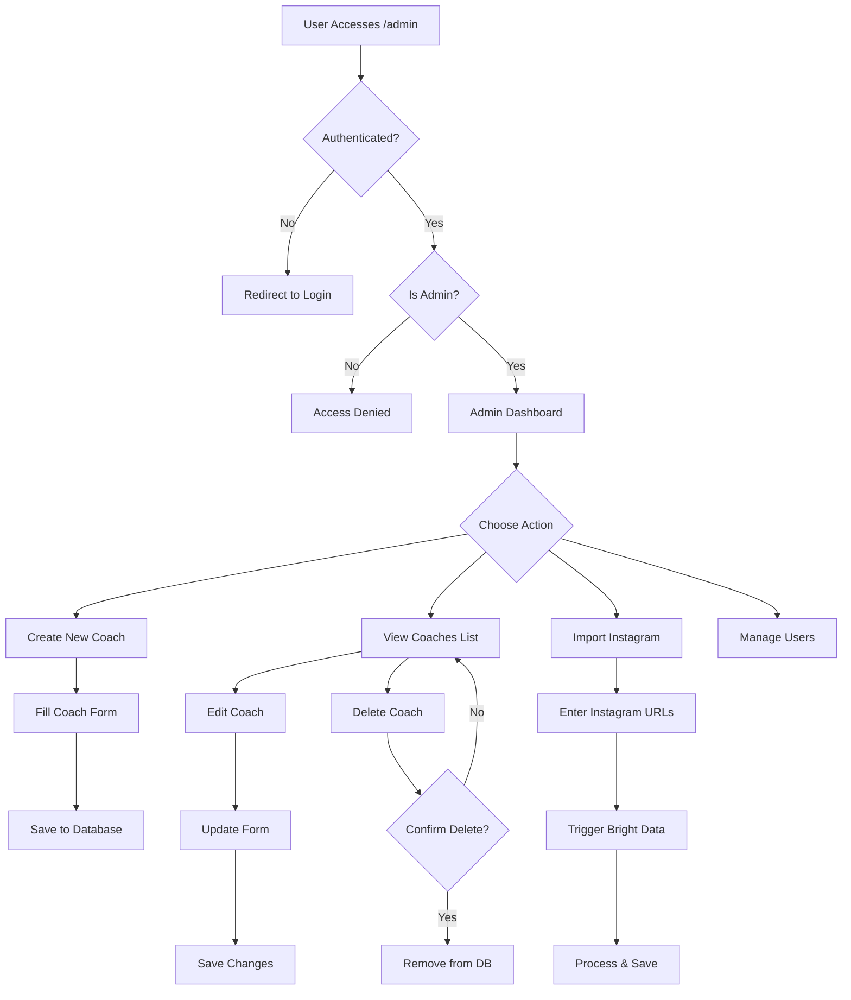
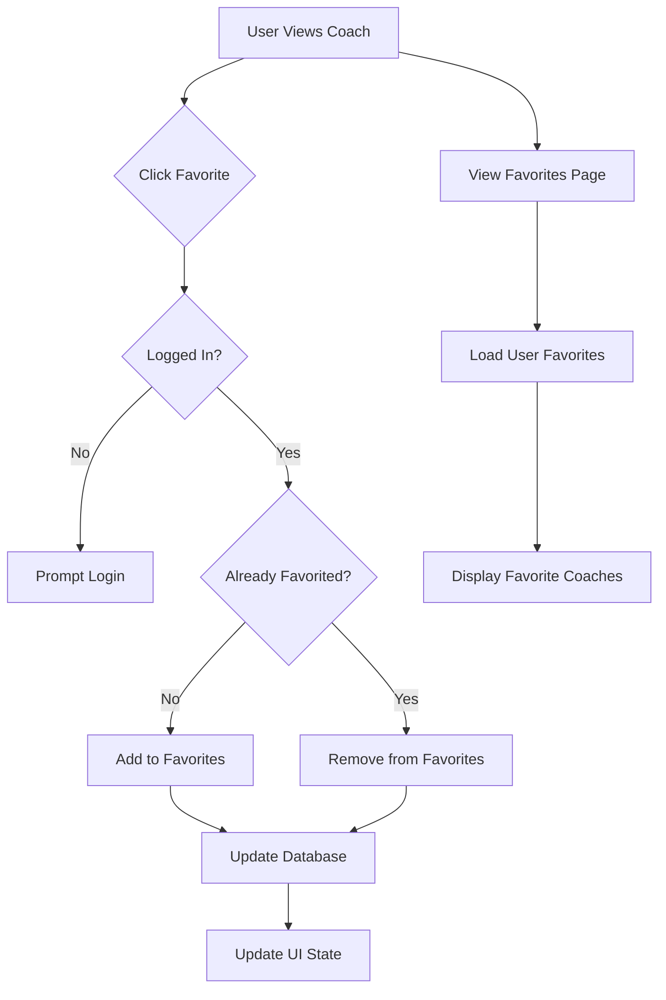
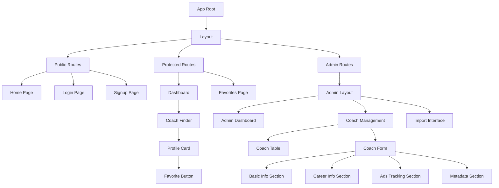
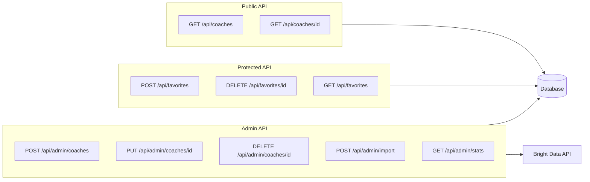
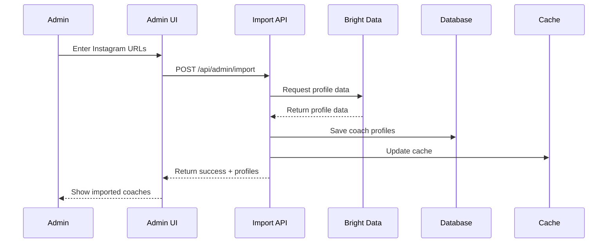
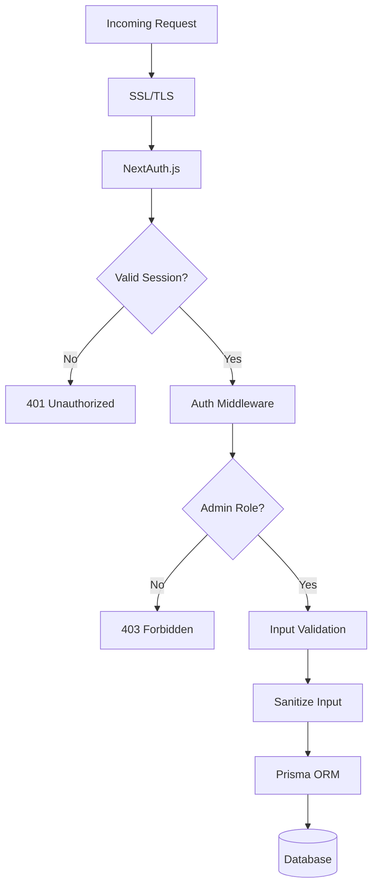
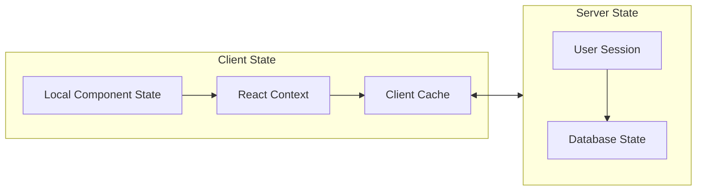

# Admin Panel Architecture Diagram

## System Architecture

## Database Schema Relationships

## Admin Panel Flow

## Favorites Feature Flow

## Component Hierarchy

## API Route Structure

## Data Flow for Instagram Import

## Security Layers

## State Management

